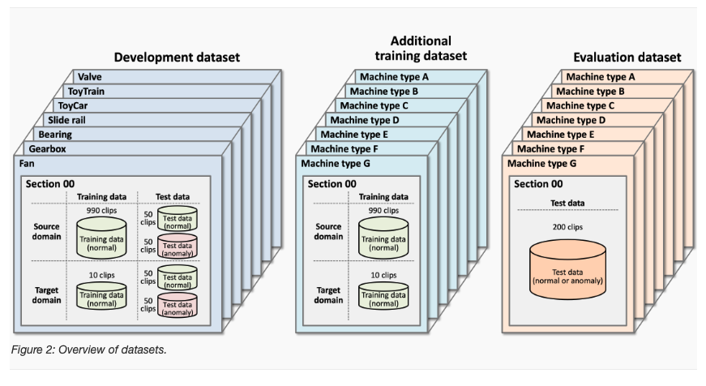
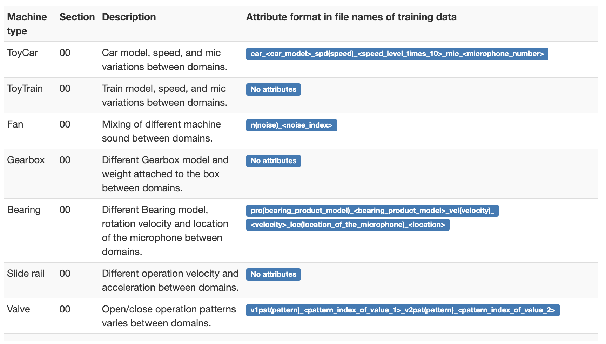

# Task 2 DCASE2024 Challenge: Anomalous sound detection

The goal of this project is to solve **Task 2** of the [**DCASE2024 Challenge: Anomalous sound detection**](https://dcase.community/challenge2024/task-first-shot-unsupervised-anomalous-sound-detection-for-machine-condition-monitoring) [[1]](#1)

## Installation
To get started, clone this repository to your local machine:
```bash
cd path/to/your/directory
git clone git@github.com:khoaphamanh/DCASE2024.git
cd DCASE2024
```
Next, you need to install Anaconda/Miniconda on your computer. After that, create a virtual environment and install the required frameworks using the following commands:
```bash
conda env create -f environment.yml
source activate dcase
```

# Datasets


In this work, we only use the training data and test data from the **development dataset**. There are a total of 7 machines that will be observed in both the source and target domains, with the number of data points in the source and target domains being 990 and 10 respectively for each machine. In the training data, there will only be normal data available, and this data will be used to train the model as well as to set the threshold for determining normal or anomalous conditions. The input data consists of clips (time series) that are 10 or 12 seconds long with a sampling frequency of 16 kHz. In the test data, we will have 50 clips for each domain and status (normal or anomalous) for each machine. The figure above provides a more detailed description of the data we are working with. The development dataset can be originaly founded at this [link](https://dcase.community/challenge2024/task-first-shot-unsupervised-anomalous-sound-detection-for-machine-condition-monitoring). Please note that while running our code, data will be automatically downloaded.

## Attributes


Each machine will have different attributes (except Gearbox and Slide). The description of the attributes will be shown in the image above. The visualize/visualize.ipynb file will visualize the data as well as each instance in the data set as well as specific information such as machine, domain, attribute and label. Because each instance is audio, users can also listen from this file to find out the difference between normal and anomaly.

## Idea
In this work, we are inspired by the Paper Aithu system for first-shot unsupervised anomalous sound detection [[2]](#2) as it is the best performing player and then optimize the parameters in our own way to aim for good results.

## Preprocessing
First, each time series will be limited to 10 seconds in length with a sampling frequency of 16k Hz. The classification label of each time series will be its machine_domain_attribute, here we will have a total of 67 labels in the training dataset. It should be noted that this is the label for the multi-class classification task, not anomaly detection, as there are only normal instances in the training dataset. . We call this data train_data, test_data is similar to train_data.

Since the number of each label is different and there is a difference between domains, we use SMOTE with k equal to 5 to generate the blacance data. However, for labels with number of instances less than k, we will use augmentation such as Gausian noise, time stretch, pitch shift and shift. We call this data smote_data.

## Model selection
The model we choose will be BEAT from Paper BEATs: Audio Pre-Training with Acoustic Tokenizers [[3]](#3) from the available checkpoint and add an attentive statistics pooling layer [[4]](#4). The output of this model is an embedding. This embedding will then go into the classifier head integrated in Adacos [[5]](#5) or Arcface [[6]](#6) loss.

## Training loop and anomaly detection
To train the model, for each epoch we will use smote_data for the classification task, the model will be optimized to predict which machine, domain and attribute a time series belongs to. The purpose of this is that, with the same label, the embeddings will tend to be close to each other and have the same distance from the origin. This is the use of Adacos and Arcface loss. During training, we used step warm up and scheduler restart in each epoch. At the same time, test_data will also be fed into the model in evaluation mode. The output of the model is embedding_smote and embedding_test corresponding to the input smote_data and test_data.

embedding_smote will be fed into the nearest neighbor model with n_neighbors equal to 1 to calculate its distance to the nearest n_neighbors, these distances will be averaged, we call this value distance_train. Since we used Adacos or Arcface loss, the distance metric we chose is cosine. The distance_train will be normalized with the standardize method.

embedding_test will be fed into the nearest neighbor model to calculate the distance, we call this distance distance_test. distance_test will also be transformed based on the standardize scaler that was applied to distance_train. And this value is the anomaly score to apply to the metric of this competition, this metric will be presented in the following section.

## Submitted metric and result

The metrics that need to be submitted in this challenge are the AUC values ​​across all machines and domains and the pAUC across all machines (there will be a total of 14 AUC values ​​corresponding to 7 machines and 2 domains and 7 pAUC values ​​corresponding to 7 machines). The final result will be the harmonic mean of all these 21 values. In this work, we were able to achieve 60.27.

## Hyperparameter Optimization

Optimizing hyperparameters in this task is not trivial in the approach we followed above since train_data has only normal instances, test_data has both normal and anomaly instances and above we used smote_data from train_data for classification purpose and test_data for anomaly detection purpose. We have experimented and manually found hyperparameters for classification and got a perfect result, however that does not mean that anomaly detection has a good result.

Therefore, to optimize the hyperparameters, we will use cross validation with k fold equal to 5. Each split will include only 5 out of 7 machines and train_data will be taken from smote_data and val_data will be taken from test_data of the selected machines. In each split, the model training will be done similarly to get the hmean value for 5 machines. The average of all hmean for 5 splits will be the kriterium for choosing the best hyperparameter.

## Running code
To run the code, please type this command to terminal.
```bash
python models/train.py
```

## References
<a id="1">[1]</a>
T. Nishida et al.
[Task 2 DCASE2024 Challenge: Anomalous sound detection ](https://github.com/domenVres/Robust-LIME-SHAP-and-IME/tree/master)

<a id="1">[2]</a>
Zhiqiang Lv et al.
[Aithu system for first-shot unsupervised anomalous sound detection](https://dcase.community/documents/challenge2024/technical_reports/DCASE2024_Lv_110_t2.pdf)

<a id="1">[3]</a>
Sanyuan Chen et al.
[BEATs: Audio Pre-Training with Acoustic Tokenizers](https://arxiv.org/pdf/2212.09058)

<a id="1">[4]</a>
Brecht Desplanques et al.
[Ecapatdnn: Emphasized channel attention, propagation and aggregation in tdnn based speaker verification](https://arxiv.org/pdf/2005.07143)

<a id="1">[5]</a>
Xiao Zhang et al.
[AdaCos: Adaptively Scaling Cosine Logits for Effectively Learning Deep Face Representations](https://arxiv.org/pdf/2005.07143)

<a id="1">[6]</a>
Jiankang Deng et al.
[ArcFace: Additive Angular Margin Loss for Deep Face Recognition](https://arxiv.org/pdf/1801.07698)