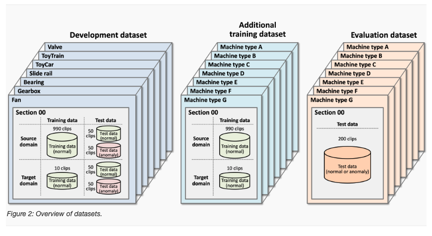

# Task 2 DCASE2024 Challenge: Anomalous sound detection

The goal of this project is to solve **Task 2** of the [**DCASE2024 Challenge: Anomalous sound detection**](https://dcase.community/challenge2024/task-first-shot-unsupervised-anomalous-sound-detection-for-machine-condition-monitoring) [[1]](#1)

## Installation
To get started, clone this repository to your local machine:
```bash
cd path/to/your/directory
git clone git@github.com:khoaphamanh/DCASE2024.git
cd DCASE2024
```
Next, you need to install Anaconda/Miniconda on your computer. After that, create a virtual environment and install the required frameworks using the following commands:
```bash
conda env create -f environment.yml
source activate dcase
```

# Datasets


In this work, we only use the training data and test data from the **development dataset**. There are a total of 7 machines that will be observed in both the source and target domains, with the number of data points in the source and target domains being 990 and 10 respectively for each machine. In the training data, there will only be normal data available, and this data will be used to train the model as well as to set the threshold for determining normal or anomalous conditions. The input data consists of clips (time series) that are 10 or 12 seconds long with a sampling frequency of 16 kHz. In the test data, we will have 50 clips for each domain and status (normal or anomalous) for each machine. The figure above provides a more detailed description of the data we are working with. The development dataset can be downloaded at this [link](https://seafile.cloud.uni-hannover.de/d/dbf9bbe9c5a94569aab6/) and unzipped in this folder.

## Attributes


## References
<a id="1">[1]</a>
T. Nishida et al.
[Task 2 DCASE2024 Challenge: Anomalous sound detection ](https://github.com/domenVres/Robust-LIME-SHAP-and-IME/tree/master)
